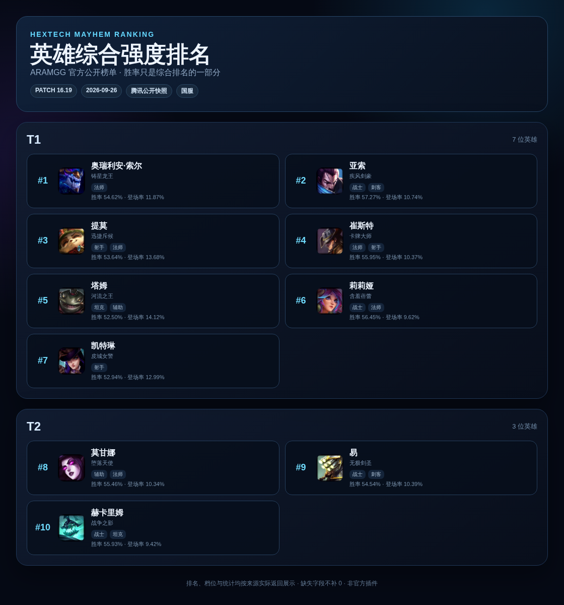
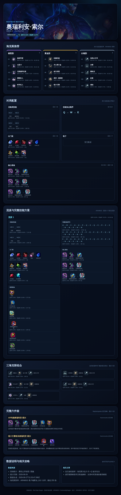

<div align="center">

<h1>海克斯乱斗</h1>

为 AstrBot 提供《英雄联盟》海克斯大乱斗英雄报告、海克斯强化查询与综合强度排名。


<br>


</div>

## 目录

- [效果展示](#效果展示)
- [功能一览](#功能一览)
- [快速开始](#快速开始)
- [常用指令](#常用指令)
- [数据来源与展示规则](#数据来源与展示规则)
- [推荐配置](#推荐配置)
- [缓存与故障降级](#缓存与故障降级)
- [依赖](#依赖)
- [推荐插件](#推荐插件)
- [声明与致谢](#声明与致谢)

## 效果展示

<details>
<summary><strong>展开查看英雄综合强度排名</strong></summary>

<br>

<div align="center">

</div>

</details>

<details>
<summary><strong>展开查看单英雄完整报告</strong></summary>

<br>

<div align="center">

</div>

</details>

> [!NOTE]
> 效果图来自插件真实运行结果。英雄数据、补丁版本、档位和推荐内容会随所选信息源更新。

## 功能一览

| 场景 | 能力 |
| --- | --- |
| 英雄报告 | 查询英雄封面、强度分档、统计数据、推荐海克斯、召唤师技能、技能加点和装备组合 |
| ARAMGG 扩展 | 展示真实流派、完整技能序列、情境装备、三海克斯组合、热门单件和相关文章 |
| 海克斯搜索 | 按中英文关键词模糊查询海克斯名称、稀有度、描述和图标 |
| 综合排名 | 按信息源提供的综合排名与强度档位生成前 10 名图片卡片，不按单一胜率自行重排 |
| 双信息源 | 默认国内优先使用 ARAMGG，也可切换为 OP.GG；两条请求链路相互隔离 |
| 名称识别 | 支持中文名、英文名、内部 ID、数字 ID、无空格英文名和 ARAMGG 别名，LLM 可作为黑话兜底 |
| 社区路线 | 可选展示 Mayhempedia 维护的真实六件套路线，不使用插件推导内容补齐 |
| 稳定性 | 共享请求超时、并发限制、单飞刷新、旧缓存回退、图片占位和完整文字降级 |

> 主要面向 QQ OneBot / `aiocqhttp`，要求 AstrBot `>=4.9.2,<5`。

## 快速开始

1. 在 AstrBot WebUI 的插件安装页面粘贴仓库地址：

   ```text
   https://github.com/muyikk/astrbot_plugin_hextechmayhem
   ```

   也可以下载仓库 ZIP 后选择“导入插件”。

2. 在插件配置中选择海斗信息源：
   - 国内环境推荐保持默认的 `aramgg`，并填写 `aramgg_api_key`。
   - 不使用 ARAMGG 时选择 `opgg`，无需填写 ARAMGG API Key。

3. 重载插件后直接查询：

   ```text
   /海斗 亚索
   /海克斯 珠光护手
   /海斗排名
   ```

> [!IMPORTANT]
> **ARAMGG API Key 与 credits**
>
> 前往 [ARAMGG 开发者后台](https://data.dtodo.cn/developer.html)，使用 GitHub 登录并创建 API Key，再填写完整的 `hx_live_...` 密钥。密钥仅作为鉴权请求头发送，不会写入报告或日志。默认每天 200 credits，单个英雄首次查询消耗 2 credits，缓存命中不会重复消耗。

> [!TIP]
> 选择 `opgg` 后，插件不会读取 ARAMGG 目录缓存，也不会请求 ARAMGG API、配置文件或图片 CDN，因此不会消耗 ARAMGG credits。

## 常用指令

| 指令 | 说明 | 示例 |
| --- | --- | --- |
| `/海斗 <英雄名>` | 生成英雄海克斯大乱斗完整图片报告 | `/海斗 Miss Fortune` |
| `/海克斯 <海克斯名>` | 生成最多 5 条海克斯搜索图片卡片 | `/海克斯 珠光护手` |
| `/海斗排名` | 生成英雄综合强度前 10 名图片卡片 | `/海斗排名` |

英雄查询同时支持中文名、英文名、英雄内部 ID 和数字 ID，例如 `/海斗 亚索`、`/海斗 Miss Fortune`、`/海斗 21`。当前 AstrBot 支持 `GreedyStr` 时可直接输入多词英文名；插件也会从原始消息恢复完整参数，以兼容较早的 AstrBot 4.x。


## 数据来源与展示规则

| 数据源 | 用途 | 使用条件 |
| --- | --- | --- |
| [Riot Data Dragon](https://developer.riotgames.com/docs/lol) | 英雄基础资产与高清封面；为 OP.GG 模式提供英雄目录 | 始终作为可信英雄资产来源 |
| [ARAMGG 数据 API](https://data.dtodo.cn/api/v1/zh-CN/docs/cf-data-api.md) | 英雄名称、别名、图标、海克斯目录、综合排名、统计、技能与装备 | `mayhem_source=aramgg`，默认且国内优先 |
| [OP.GG](https://op.gg/zh-cn/lol/modes/aram-mayhem) | 英雄综合排名、推荐海克斯、召唤师技能、技能加点与装备 | `mayhem_source=opgg`，解析公开服务端页面 |
| [CommunityDragon](https://www.communitydragon.org/) | OP.GG 模式下的海克斯稳定 ID、名称、稀有度、描述和图标 | 仅 OP.GG 模式使用 |
| [Mayhempedia](https://github.com/boxsbraindump/Mayhempedia) | 社区维护的真实六件套路线 | `enable_mayhempedia_source=true` 时使用 |

### 英雄资料与排名

- ARAMGG 模式直接使用其英雄目录、中文名、称号、英文别名和图标；OP.GG 模式使用 Riot Data Dragon 的英雄目录与图标。
- 报告仅展示英雄封面，不展示英雄简介、被动或 QWER 技能详情；技能加点顺序来自所选海斗信息源。
- `/海斗排名`遵循信息源自身的综合排序和强度档位，不根据胜率重新计算排名。
- 胜率、登场率、场次和排名变化只在响应真实提供时展示，不推算缺失字段，也不补成 `0`。

### 海克斯与装备

- ARAMGG 模式使用 ARAMGG 海克斯目录；OP.GG 模式将页面名称重新匹配至 CommunityDragon 后才进入报告。
- 英雄报告中棱彩、黄金和白银海克斯的展示数量分别受 `max_augments_per_rarity` 限制。
- ARAMGG 单英雄响应还会解析真实流派、18 级技能序列、情境装备、三海克斯组合、热门单件、数据日期和相关文章，不额外请求兼容接口。
- `fullItems` 为空时不会从核心装备或热门单件推导六神装。

### 社区路线与 LLM

- Mayhempedia 路线始终标注为“社区攻略”，最多展示三条真实六件套；不足三条时不会自动补齐。
- 当前英雄目录和别名无法匹配时，才会调用所选 LLM Provider 识别玩家黑话。
- 模型结果必须重新匹配英雄目录，不会直接作为网络地址使用。

## 推荐配置

| 配置 | 建议 |
| --- | --- |
| `mayhem_source` | 国内环境优先使用默认值 `aramgg`；无法使用 ARAMGG 时切换为 `opgg` |
| `aramgg_api_key` | ARAMGG 模式必填；从开发者后台获取完整的 `hx_live_...` 密钥 |
| `llm_provider_id` | 可选；需要识别“奥巴马”“奶妈”等玩家黑话时再选择 Provider |
| `enable_mayhempedia_source` | 默认关闭；需要社区六件套且可接受额外请求耗时时再开启 |
| `max_concurrent_requests` | 建议保持 `3`，设置过高可能触发第三方站点限流 |

<details>
<summary><strong>完整配置项</strong></summary>

| 配置项 | 默认值 | 说明 |
| --- | ---: | --- |
| `llm_provider_id` | 空 | 用于英雄别名识别的 LLM Provider。ARAMGG 名称和别名无法匹配时识别玩家黑话；留空即关闭。模型结果只会重新匹配英雄列表，不会直接作为网络地址使用 |
| `mayhem_source` | `aramgg` | 选择海斗信息源，可选 `opgg`、`aramgg`；用于英雄胜率、登场率、场次、海克斯和出装统计，国内优先使用 ARAMGG |
| `aramgg_api_key` | 空 | 仅在 `mayhem_source=aramgg` 时使用；密钥只作为鉴权请求头发送，不会写入报告或日志 |
| `enable_mayhempedia_source` | `false` | 启用 Mayhempedia 社区六件套路线；最多展示三条真实路线，开启后可能增加查询耗时 |
| `request_timeout_seconds` | `20` | Riot Data Dragon、ARAMGG、OP.GG 和 Mayhempedia 的请求超时；有效范围 5–120 秒 |
| `cache_ttl_seconds` | `3600` | 实时数据的内存缓存有效时间；刷新失败时继续使用进程内最近一次成功的数据，插件重启后内存缓存消失 |
| `max_concurrent_requests` | `3` | 最大并发上游请求数；有效范围 1–10，数值过高可能触发第三方站点限流 |
| `max_results` | `5` | `/海克斯`搜索最多展示条数；有效范围 1–10 |
| `max_augments_per_rarity` | `5` | 英雄报告每个稀有度最多展示的海克斯数量；有效范围 1–10，分别限制棱彩、黄金和白银推荐 |
| `proxy` | 空 | 访问实时数据源时使用的 HTTP 代理，例如 `http://127.0.0.1:7890`；留空时不显式设置代理 |

旧配置 `max_interactions` 已弃用。若配置文件仍存在该字段，插件只记录一次提示，不再使用其值控制报告内容。

</details>

## 缓存与故障降级

ARAMGG 英雄列表、英雄别名和海克斯目录会保存到固定缓存文件：

```text
data/plugin_data/astrbot_plugin_hextechmayhem/cache/
├── aramgg_champions.json
└── aramgg_augments.json
```

插件启动时先读取本地目录缓存，再访问不消耗 credits 的 ARAMGG `config.json` 检查 `dataVersion`；只有版本变化时才下载并原子替换缓存文件。网络不可用但本地目录有效时继续使用本地数据。

单英雄统计、OP.GG 页面、社区路线、LLM 结果和图片只保存在当前进程内。缓存过期后会单飞刷新；刷新失败但有旧缓存时继续使用并标记“缓存数据”，冷启动失败时只隐藏对应模块。

> [!WARNING]
> 第三方站点结构变化、限流、访问验证或网络故障可能使部分模块暂时不可用。单个图标失败时使用占位块；HTML 图片渲染失败时发送包含相同字段的完整文字报告，不阻断其他可用数据源。

图片下载只接受可信 HTTPS 域名，并校验最终重定向、Content-Type 和响应体大小。最终报告通过 Base64 图片发送，不在磁盘中持久化。

## 依赖

AstrBot 会根据 `requirements.txt` 自动安装：

```text
aiohttp
beautifulsoup4
certifi
Pillow
yarl
```

## 推荐插件

| 插件 | 功能 |
| --- | --- |
| [JMComic 禁漫搜索下载](https://github.com/muyikk/astrbot_plugin_jmcomic) | 搜索 JMComic、查看详情，并下载生成可发送的完整或分片 PDF`（因为某些原因无法上架官方😁）` |

## 声明与致谢

- 英雄资料与资产：[Riot Games Data Dragon](https://developer.riotgames.com/docs/lol)
- 国内优先英雄统计：[ARAMGG 数据 API](https://data.dtodo.cn/api/v1/zh-CN/docs/cf-data-api.md)
- 备用英雄统计：[OP.GG](https://op.gg/zh-cn/lol/modes/aram-mayhem)
- OP.GG 模式海克斯定义与资产：[CommunityDragon](https://www.communitydragon.org/)
- 社区攻略路线：[Mayhempedia](https://github.com/boxsbraindump/Mayhempedia)
- 功能设计参考：[PayneXie/astrbot_plugin_hextech](https://github.com/PayneXie/astrbot_plugin_hextech)
- 插件图标：Riot Data Dragon 的 ARAM: Mayhem “Friends in Mayhem”召唤师图标（ID 7011）

本插件与 Riot Games、ARAMGG、OP.GG 和 Mayhempedia 均无官方关联。请遵守相关服务条款和 Riot Games 的知识产权政策。

项目采用 [GNU General Public License v3.0](LICENSE)，详细的第三方来源与许可说明见 [NOTICE](NOTICE)。
